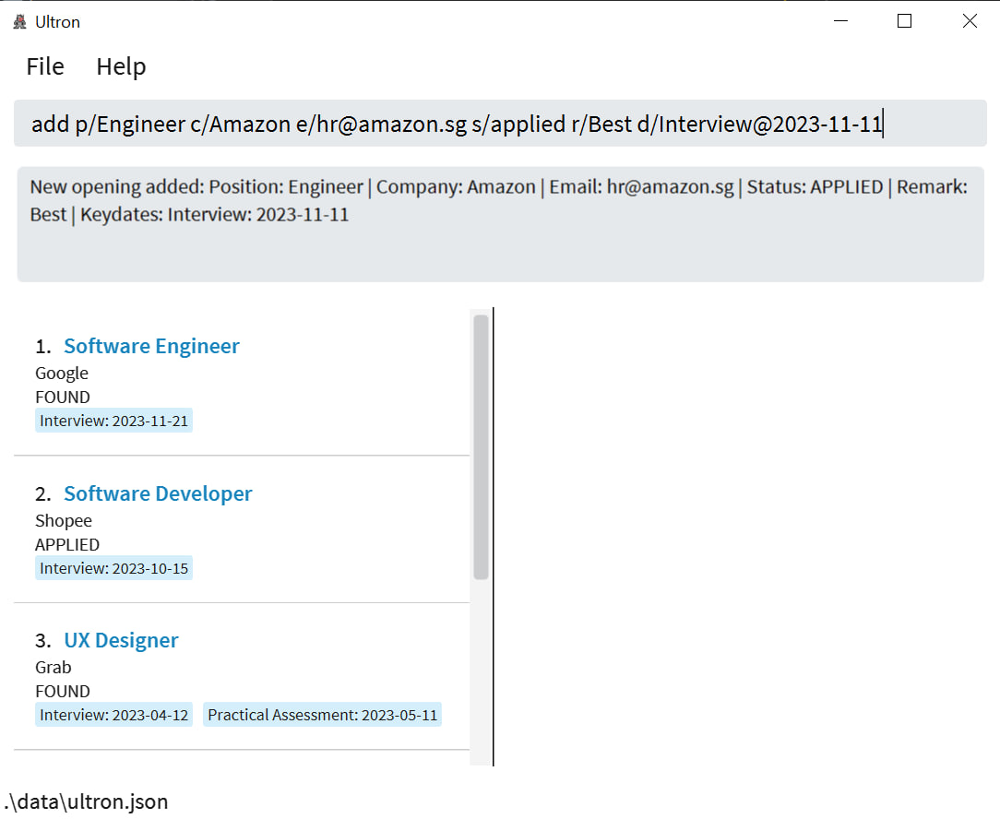
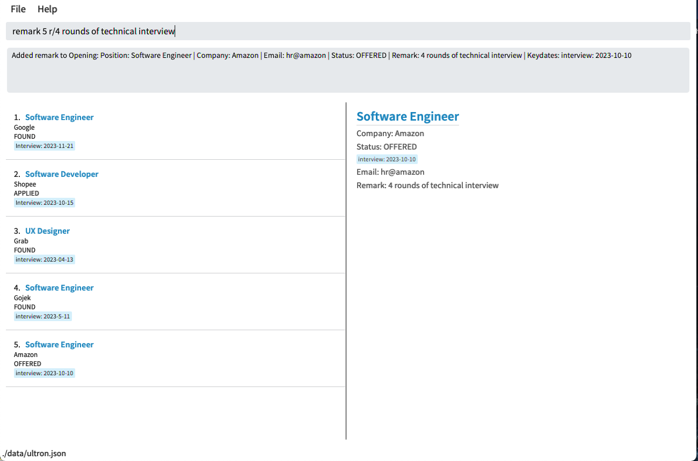
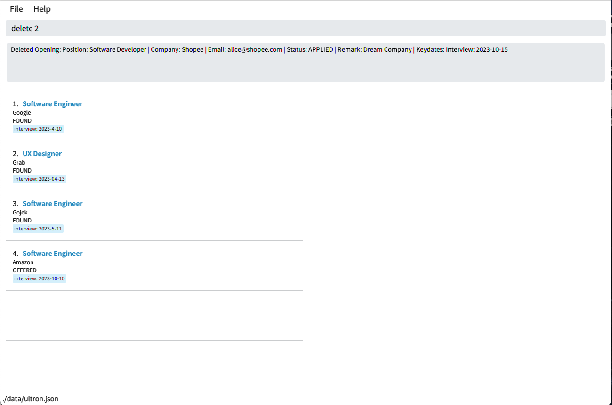

Ultron is a **desktop app for compiling job and internship applications, optimized for use through keyboard typing and minimizing mouse clicking.** 

If you are familiar with the Ultron interface and can type fast, it can help you organise your internship applications in a much more efficient and structured manner compared to traditional methods such as using spreadsheets.

---

## Table of Contents

- [Table of Contents](#table-of-contents)
- [Navigation](#navigation)
- [Glossary](#glossary)
- [Quick Start](#quick-start)
    - [Java Instructions](#java-instructions)
- [Features](#features)
    - [Adding an opening : `add`](#adding-an-opening--add)
    - [Listing all openings : `list`](#listing-all-openings--list)
    - [Editing an opening : `edit`](#editing-an-opening--edit)
    - [Editing an opening's remarks : `remark`](#editing-an-openings-remarks--remark)
    - [Showing full details of opening: `show`](#showing-full-details-of-opening--show)
    - [Listing upcoming dates : `upcoming`](#listing-upcoming-dates--upcoming)
    - [Filtering openings by company or position: `find`](#filtering-openings-by-company-or-position--find)
    - [Filtering openings by status: `status`](#filtering-openings-by-status--status)
    - [Deleting an opening : `delete`](#deleting-an-opening--delete)
    - [Deleting all openings : `clear`](#deleting-all-openings--clear)
    - [Accessing help window : `help`](#accessing-help-window--help)
    - [Exiting the program : `exit`](#exiting-the-program--exit)
    - [Saving the data](#saving-the-data)
- [FAQ](#faq)
- [Command summary](#command-summary)

---

## Navigation

All sections of the User Guide(UG) is organized neatly into the Table of Contents in a hierarchical structure. Clickable text, such as in the Table of Contents, can be used to easily navigate to relevant sections of the UG. Some are also links that will navigate you to relevant websites.

---

## Glossary

### Opening
Representation of an internship application, which contains all relevant information needed in your application journey.

### Keydate
Representation of important dates or deadlines of key events such as an Online Assessment or Zoom Interview, allowing you to neatly organise and track all dates, past and future.

---

## Quick Start

1. Ensure you have Java version `11` or above installed in your Computer. Instructions to check or download Java version `11` can be found [here](#java-instructions).

2. Download the latest `ultron.jar` from [here](https://github.com/AY2223S2-CS2103T-F12-4/tp/releases/download/v1.3/ultron.jar).

3. Copy the file to the folder you want to use as the _home folder_ for your Ultron.

4. Open a command terminal, `cd` into the folder you put the jar file in, and use the `java -jar ultron.jar` command to run the application. 
   You should see something similar to the image below in a few seconds. Note how the app contains some sample data. 

5. The app provides you with a text input box at the top for user commands, as well as both a summary list of openings on the left panel and a right panel containing more details of any particular opening.

6. Type the command in the command box and press Enter to execute it. e.g. typing **`help`** and pressing Enter will open the help window. 
   Some example commands you can try:
    - `list` : Lists all openings.
    - `add c/Google p/Engineer e/google@gmail.com s/applied` : Adds an opening to Ultron, representing having applied at Google for an Engineer position.
    - `delete 3` : Deletes the 3rd opening shown in the current list.
    - `show 1` : Displays on the right panel, more details of the 1st opening in the current list
    - `clear` : Deletes all openings.
    - `exit` : Exits the app.

Refer to the [Features](#features) below for details of each command.

### Java Instructions

For Windows users:
1. Open the **Windows Start Menu** and launch the **Command Prompt**.

2. Type in the `java -version` command to confirm the status of your Java version.

3. Example response : `java version "11.0.17"` or `openjdk version "11.0.18"`
    1. If the first number in the number list is `11`, it indicates that you are using Java version `11` and you are done!
    2. If the number is not `11`, you can update Java by first uninstalling Java, following the instructions [here](https://explainjava.com/uninstall-java-windows/).
    3. You can then download Java version `11` from this [source](https://www.oracle.com/java/technologies/javase/jdk11-archive-downloads.html), following the instructions [here](https://explainjava.com/install-java-windows/).
    4. Finally, you can type `java -version` in your Command Prompt again to ensure you have Java version `11`.

4. Example response : `java is not recognized...`.
    1. This means Java is not downloaded, so you need to download Java version `11` from this [source](https://www.oracle.com/java/technologies/javase/jdk11-archive-downloads.html), following the instructions [here](https://explainjava.com/install-java-windows/).
    2. Then, you can type `java -version` in your Command Prompt again to ensure you have Java version `11`.

For macOS users:
1. Open the **Terminal**.

2. Type in the `java -version` command to confirm the status of your Java version.

3. Example response : `java version "11.0.17"`
    1. If the first number in the number list is `11`, it indicates that you are using Java version `11` and you are done!
    2. If the number is not `11`, you can update Java by first uninstalling Java, following the instructions [here](https://www.java.com/en/download/help/mac_uninstall_java.html)
    3. You can then download Java version `11` from this [source](https://www.oracle.com/java/technologies/javase/jdk11-archive-downloads.html), following the instructions [here](https://docs.oracle.com/en/java/javase/11/install/installation-jdk-macos.html#GUID-2FE451B0-9572-4E38-A1A5-568B77B146DE)
    4. Finally, you can type `java -version` in your **Terminal** again to ensure you have Java version `11`.

4. Example response : `java: command not found`.
    1. This means Java is not downloaded, so you need to download Java version `11` from this [source](https://www.oracle.com/java/technologies/javase/jdk11-archive-downloads.html), following the instructions [here](https://docs.oracle.com/en/java/javase/11/install/installation-jdk-macos.html#GUID-2FE451B0-9572-4E38-A1A5-568B77B146DE)
    2. Then, you can type `java -version` in your **Terminal** again to ensure you have Java version `11`.

After ensuring you have Java version `11`, you can return to [Quick Start](#quick-start).

---

## Features

**:information_source: Notes about the command format:** 

- All commands consists of a command word e.g `add`. Some commands require fields which start with 
- their corresponding prefixes e.g. `r/` for remarks. Indexes are required for some commands to specify the exact opening of interest. e.g. `delete 1` deletes the first opening. 

- Internship applications are represented as openings, By using clean and optimized representation of important dates or deadlines as *keydates*,

- Words in `UPPER_CASE` are the parameters to be supplied by the user. 

  e.g. in `add p/POSITION`, `POSITION` is a parameter which can be used as `add p/Software Engineer`.

- Items in square brackets are optional. 
  e.g. `c/COMPANY [d/KEYDATE]` can be used as `c/Google d/Interview@2023-04-01` or as `c/Google`.

- Items with `…`​ after them can be used multiple times including zero times. 
  e.g. `[d/KEYDATE]…​` can be used as ` ` (i.e. 0 times), `d/Interview@2023-04-01`, `d/Interview@2023-04-01 d/OA@2023-05-02` etc.

- Parameters can be in any order. 
  e.g. if the command specifies `p/POSITION c/COMPANY`, `c/COMPANY p/POSITION` is also acceptable.

- If a parameter is expected only once in the command but you specified it multiple times, only the last occurrence of the parameter will be taken, excluding `status` command. 
  e.g. if you specify `c/Google c/Shopee`, only `c/Shopee` will be taken.

- Extraneous parameters for commands that do not take in parameters (such as `exit`) will be ignored. 
  e.g. if the command specifies `exit 123`, it will be interpreted as `exit`.

### 1. Adding an opening : `add`

Having too many internships offers and being unable to keep track of all of them?
Ultron provides you with a platform to remember all your openings so you don't have to!
Just type `add` followed by details of your opening in the format below and you can see
it being added to Ultron.

Format: `add p/POSITION c/COMPANY e/EMAIL s/STATUS [r/REMARK] [d/KEYDATE]…​`

- `KEYDATE` must be in the form `KEY@DATE`, where `KEY` is a key event in the application process and `DATE` is the date of the event in `YYYY-MM-DD` format.
- `KEY` must only contain alphabetic characters, cannot be blank and cannot only contain whitespaces.
- `STATUS` must be of either **found, applied, interviewing, offered, accepted or rejected** and is case-insensitive.
- If both `COMPANY` and `POSITION` of a new opening matches a current opening, the new opening will not be added.
- The openings in the list only display `POSITION`, `COMPANY`, `STATUS` and `KEYDATES`.
- To view the full details of the opening, use `show` command.

Examples:

- `add p/Software Engineer c/Google e/chinese@google.com s/interviewing d/Interview@2023-03-14`

### 2. Listing all openings : `list`

Ultron gives you the option to view all your recorded openings in one window. Just type 'list'
and the full list of openings will be displayed starting with the earliest added opening. This is especially useful if you want to return to the full list of openings after filtering the list using commands like `find` [here](#filtering-openings-by-company-or-position--find) and `upcoming` [here](#listing-upcoming-dates--upcoming).

Format: `list`

- Openings are displayed in order of when it was added, with the latest added opening at the bottom.

### 3. Editing an opening : `edit`

Accidentally typed the wrong company name? Don't worry, Ultron allows you to edit a previously
added opening without having to delete and start over. Just type in 'edit' followed by the index
number of the desired opening with the field you want to change. Ultron will update the opening with just a single line of command.

Format: `edit INDEX [p/POSITION] [c/COMPANY] [e/EMAIL] [s/STATUS] [d/KEYDATE]…​`

- Edits the opening at the specified `INDEX`. The index refers to the index number shown in the displayed opening list. The index **must be a positive integer** 1, 2, 3, …​
- At least one of the optional fields must be provided.
- Existing values will be updated to the input values.
- When editing `KEYDATE`, the existing `KEYDATE` of the opening will be removed i.e adding of `KEYDATE` is not cumulative.
- You can remove all the `KEYDATE` of the opening by typing `d/` without
  specifying any `KEYDATE` after it.

Examples:

- `edit 1 c/Goggle e/johndoe@example.com` Edits the company and email address of the 1st opening to be `Goggle` and `johndoe@example.com` respectively.
- `edit 2 c/Shopee d/` Edits the company of the 2nd opening to be `Shopee` and clears all existing `KEYDATE`.

### 4. Editing an opening's remarks : `remark`

What happens when there is a change of information? Ultron gives you the flexibility to edit the remarks of any opening
so that you can keep track of real time data without the need for any unnecessary additions.

Format: `remark INDEX r/REMARK`

- Edits the remark of the opening at the specified `INDEX`. The index refers to the index number shown in the displayed opening list.
- The index **must be a positive integer** 1, 2, 3, …​
- Existing values will be updated to the input values.
- When editing `REMARK`, the existing `REMARK` of the opening will be removed i.e editing of `REMARK` is not cumulative.
- You can remove all the `REMARK` of the opening by typing `d/` without
  specifying any `REMARK` after it.

### 5. Showing full details of opening: `show`

Ultron stays organised by only showing key details on the left panel. This feature allows you to view full details of any opening on the right panel, by using the index of the opening. Ultron even has added functionality to allow you to simply click on the opening of interest on the left panel, achieving the same result.

Format: `show INDEX`

- Show details of the opening at the specified `INDEX`.
- The index refers to the index number shown in the displayed opening list.
- The index **must be a positive integer** 1, 2, 3, …​

### 6. Listing upcoming dates : `upcoming`

Lists openings which has events today or within the next `DAYS` days, 

Format: `upcoming DAYS`

- Lists all openings which has events today or within the next `DAYS` days.
- `DAYS` **must be a positive integer** 1, 2, 3, …​

**Display order** : All relevant 

Examples:

- `upcoming 1` lists all openings with events happening in the next 1 day, ie. today or tomorrow.

### 7. Filtering openings by company or position: `find`

Want to find only companies that you have already applied for? Ultron's `find` command gives you the
capability to filter Ultron by company or position so you do not have to scroll through the entire
list to find the opening you desire.

Format: `find KEYWORD [MORE_KEYWORDS]`

- The search is case-insensitive. e.g. `google` will match `Google`
- The order of the keywords does not matter. e.g. `Goldman Sachs` will match `Sachs Goldman`
- Only the company and position field is searched.
- Only full words will be matched e.g. `Amaz` will not match `Amazon`
- Openings with COMPANY or POSITION matching at least one keyword will be returned (i.e. `OR` search).
  e.g. `find google amazon software` will return openings of `Google`, `Software Engineer`, `Amazon Web Services`

Examples:

- `find Google` returns `google` and `Google Cloud`
- `find bank america` returns `Bank of America`, `Bank of Singapore`, `Bank Manager` 

### 8. Filtering openings by status: `status`

Want to find out which companies are at a specific stage of application? Use `status` to quickly scan through
Ultron to find the status you desire.

Format: `status KEYWORD`

- `KEYWORD` **must be of either found, applied, interviewing, offered, accepted or rejected**.
- The search is case-insensitive. e.g. `Applied` will match `applied`
- Only the status field is searched.
- Partially spelled words will not be matched e.g. `off` will not match `offered`

Examples:

- `status Interviewing` returns openings with status Interviewing. 

### 9. Deleting an opening : `delete`

Accidentally made errors which are too inconvenient to change? Ultron makes it easy for you to delete
the opening with just one command word.

Format: `delete INDEX`

- Deletes the opening at the specified `INDEX`.
- The index refers to the index number shown in the displayed opening list.
- The index **must be a positive integer** 1, 2, 3, …​

Examples:

- `list` followed by `delete 2` deletes the 2nd opening in the opening list.

### 10. Deleting all openings : `clear`

Want to start from scratch? Just use clear and you will be presented with a clean Ultron ready for
use!

Format: `clear`

- This command allows you to delete all openings from the list in a single command. Useful when you want to start a fresh new list!

### 11. Accessing help window : `help`

Displays the help window.

Format: `help`

### 12. Exiting the program : `exit`

Exits the program.

Format: `exit`

### 13. Saving the data

Ultron data are saved in the hard disk automatically after any command that changes the data. There is no need to save manually.

## FAQ

**Q**: Why does the remarks not show up after editing?

**A**: Remarks will only be displayed when `show` command is used.

**Q**: How do I transfer my data to another Computer?

**A**: Install the app in the other computer and overwrite the empty data file it creates with the JSON file 'data/ultron.json'.

---

## Command summary

| Action       | Format, Examples                                                                                                                                                              |
|--------------|-------------------------------------------------------------------------------------------------------------------------------------------------------------------------------|
| **Add**      | `add p/POSITION c/COMPANY e/EMAIL s/STATUS [r/REMARK] [d/KEYDATE]…​`   e.g., `add p/Software Engineer c/Google e/chinese@google.com s/interviewing d/Interview@2023-03-14` |
| **Edit**     | `edit INDEX [p/POSITION] [c/COMPANY] [e/EMAIL] [s/STATUS] [d/KEYDATE]…​`   e.g., `edit 1 c/Goggle e/johndoe@example.com`                                                   |
| **Delete**   | `delete INDEX`  e.g., `delete 3`                                                                                                                                           |
| **Status**   | `status STATUS`  e.g., `status interviewing`                                                                                                                               |
| **List**     | `list`                                                                                                                                                                        |
| **Clear**    | `clear`                                                                                                                                                                       |
| **Upcoming** | `upcoming DAYS`  e.g., `upcoming 1`                                                                                                                                       |
| **Show**     | `show INDEX`  e.g., `show 1`                                                                                                                                              |
| **Remark**   | `remark INDEX r/REMARK`  e.g., `remark 1 r/1 round of interview`                                                                                                          |
| **Find**     | `find KEYWORD [MORE_KEYWORDS]...`  e.g., `find Engineer data Software`                                                                                                    |
| **Help**     | `help`                                                                                                                                                                        |
| **Exit**     | `exit`                                                                                                                                                                        |
